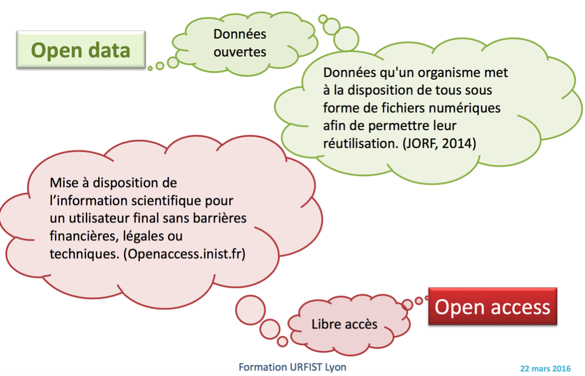
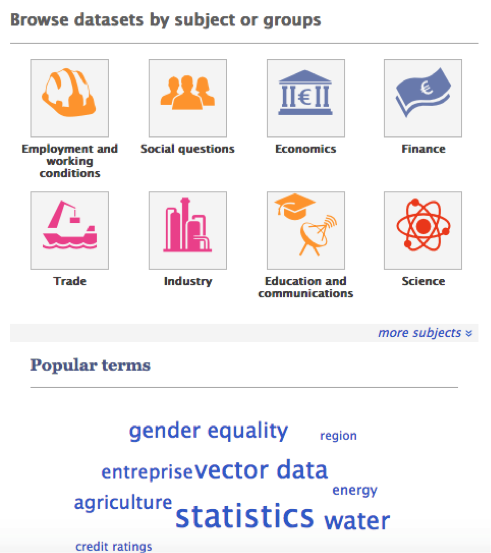
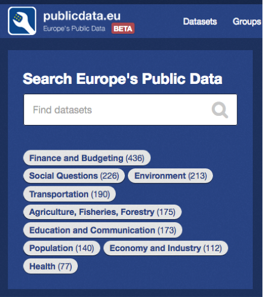
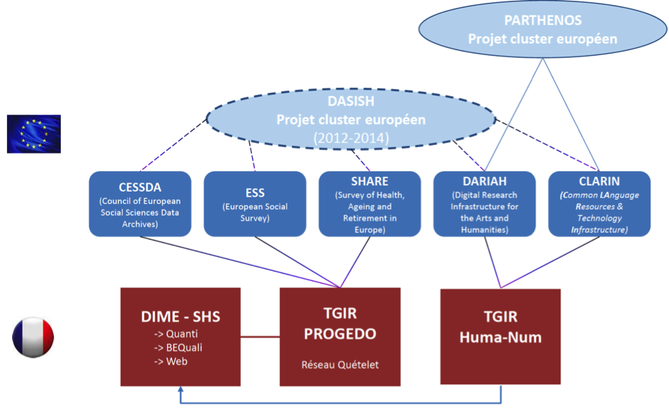
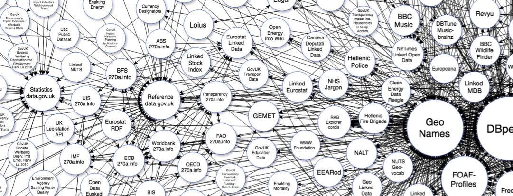

# Open Data and Openly Accessible Data

## Definition : 
The figure below gives a definition of what is Open Data and what is Open Access to data.

### Learn more about it
Towards Open Science \[1\] is a movement to make scientific research, data and dissemination accessible
to all levels of an inquiring society (see «TreeTaxonomic»
[*https://www.fosteropenscience.eu/*](https://www.fosteropenscience.eu/)).

## Open Government data

**What is Open Government Data?** Open government data means \[2\]:

-   Data produced or commissioned by government or government controlled
    entities.

-   Data which is open as defined in the [*Open
    Definition*](http://www.opendefinition.org/) – that is, it can be
    freely used, reused and redistributed by anyone.

**Why Open Government Data?** There are three main reasons \[2\]:

1.  Transparency: not just access, but also sharing and reuse.

2.  Releasing social and commercial value : creation of innovative
    business and services that deliver social and commercial value.

3.  Participatory Governance: making a full “read/write” society,
    able to contribute to the process of governance.

Many governments created online portals to publish their data, ex.:

-   France: [*https://www.data.gouv.fr/*](https://www.data.gouv.fr/)

-   UK: [*https://data.gov.uk/*](https://data.gov.uk/)

-   USA: [*https://www.data.gov/*](https://www.data.gov/)

For the European Union, two portals are available:

1.  The [*EU Open Data Portal*](http://data.europa.eu/euodp/en/data): gives
    access to open data from the EU institutions, agencies and other
    bodies.

2.  The [*Public Data*](http://publicdata.eu/) portal: provides datasets
    from local, regional and national public bodies across Europe.

## Non governmental organizations data

### Open multidisciplinary repositories

-   [*OpenAIRE*](https://www.openaire.eu/) : open Access to  peer-reviewed journal articles, conference papers and datasets of various kinds from different data providers :
    - [*PANGAEA*](https://www.pangaea.de/)
    - [*Zenodo*](https://zenodo.org/)
    - [*DRYAD*](http://datadryad.org/)
    - [*UK Data Archive*](http://www.data-archive.ac.uk/)
    - [*Harvard Dataverse*](https://dataverse.harvard.edu/)
    - etc.

-   [*The Common Crawl dataset*](http://commoncrawl.org/the-data/) : the Common Crawl corpus contains petabytes of data collected over the last 7 years. It contains _raw
    web page data_, _extracted metadata_ and _text extractions_. The dataset lives on Amazon S3 as part of the [*Amazon Public Datasets*](http://aws.amazon.com/public-data-sets/) program. From
    Public Data Sets, you can download the files entirely free using HTTP or S3.

-   [*Plateform ISC-PIF*](https://iscpif.fr/itservices/) :
    1.  Infrastructure and Platform as a service : [*itservices*](https://iscpif.fr/itservices/)
    2.  Open platforms : [*open-platforms*](https://iscpif.fr/services/open-platforms/)

-   [*United Nations*](http://data.un.org/Default.aspx) : open statistical data from member States and UN Agencies.

-   [*The World Bank*](http://data.worldbank.org/) : open statistical data relating to developing countries.

### Open repositories for Social Sciences

This is a list of repositories and databases for open data in social sciences (**international**). Access is open unless otherwise stated.

-   [*Australian Social Science Data Archive*](http://assda.anu.edu.au/) : from the [*Australian Demographic and Social Research
    Institute*](http://adsri.anu.edu.au/) at the *[Australian National
    University](http://www.anu.edu.au/).*

-   [*CESSDA Data Portal*](http://www.nsd.uib.no/cessda/extcessda.jsp) :
    consortium of European Social Science Data Archives. From the
    [*Council of European Social Science Data
    Archives*](http://www.nsd.uib.no/cessda/home.html) (CESSDA).

-   [*Databrary*](https://nyu.databrary.org/) : a repository for sharing
    and reusing research video data and related metadata in the
    developmental and learning sciences. Hosted at New York University
    with support from The Pennsylvania State University. (Registration
    required)

-   [*DReSNeT*](http://www.dresnet.net/) : [*Digital Repositories
    E-Science Network*](http://www.dresnet.net/). From the UK
    [*Engineering & Physical Sciences Research
    Council*](http://www.epsrc.ac.uk/) (EPSRC). A network of social
    science repositories for texts and data.

-   [*Economic and Social Science Data Service:*](http://www.esds.ac.uk/)
    From the [*UK Data Archive (UKDA)*](http://www.data-archive.ac.uk/) and [*Institute for Social
    and Economic Research (ISER)*](http://www.iser.essex.ac.uk/),
    University of Essex; [*Manchester Information and Associated Services (MIMAS)*](http://www.mimas.ac.uk/),
    and the [*Cathie Marsh Centre for Census and Survey Research
    (CCSR)*](http://www.ccsr.ac.uk/), University of Manchester.
    (Registration required)

-   [*ICPSR*](http://www.icpsr.umich.edu/icpsrweb/ICPSR/) :
    inter-University Consortium for Political and Social Research. At
    the University of Michigan.

-   [*National Archive of Criminal Justice Data*](http://www.icpsr.umich.edu/icpsrweb/NACJD/index.jsp) : holds
    over 700 data collections relating to criminal justice.

-   [*Roper Center for Public Opinion Research*](http://ropercenter.cornell.edu/) : data from surveys of
    public opinion from the 1930s to the present.

This is a list of repositories and databases for open data in social
sciences (**national**). Access is open unless otherwise stated.

-   [*Réseau Quetelet*](http://www.reseau-quetelet.cnrs.fr/spip/) :
    coordinates the archiving, documentation and distribution of data in
    the humainities and social sciences from the Centre Maurice
    Halbwachs (ADISP), the Centre for Socio-political Data (CDSP) and
    the INED data service. (Open. The user is requested to sign an
    obligations form).

-   [*Progedo Data Infrastructure*](http://www.progedo.fr/) : the
    PROGEDO large infrastructure ensures the implementation of a public
    policy for social sciences and humanities. It focuses especially on
    research on law, economics, geography, management, history,
    political sciences and sociology.

-   [*Huma-Num*](http://www.huma-num.fr/) (services
    [*Isidore*](https://www.rechercheisidore.fr/) et
    [*Nakala*](https://www.nakala.fr/)) : une très grande infrastructure
    de recherche (TGIR) visant à faciliter le tournant numérique de la
    recherche en sciences humaines et sociales. Met à disposition un
    ensemble de services pour le stockage, le traitement, l'exposition,
    le signalement, la diffusion et la conservation sur le long termes
    des données numériques de la recherche en sciences humaines et
    sociales.

Coordination of infrastructures in social sciences \[1\] (European and national levels)
---------------------------------------------------------------------------------------

## Linked Open Data (LOD)

The term ‘‘Linked Data’’ refers to the trend of connecting and
publishing data using the web. It aims to publish not only documents but
also data, and contributes to the extension of the web into a global
data space based on open standards (semantic web standards: RDF,
SPARQL). This data space is called the ‘’Web of data’’ \[3\].

It was created in response to two main questions:

1.  *How to publish data that is reusable?*
2.  *How to promote the integration of data from different sources?*

The proposed solutions consist in imposing a structure on the data to
facilitate their sharing and reuse and to use a standard model to
facilitate their discovery and integration.

Linked Data definition from <http://linkeddata.org/> :

*“Linked Data is about using the Web to connect related data that wasn't
previously linked, or using the Web to lower the barriers to linking
data currently linked using other methods. More specifically, Wikipedia
defines Linked Data as "a term used to describe a recommended best
practice for exposing, sharing, and connecting pieces of data, information and knowledge
on the Semantic Web using [URIs](http://en.wikipedia.org/wiki/URI) and
[RDF](http://en.wikipedia.org/wiki/Resource_Description_Framework)." ”*

A significant number of organizations have adopted the principles of
linked data as a way to publish their data, which has created a global
space of interconnected data consisting of several billions of RDF
triples from many sources: geographical data, statistics, genetic data,
medical data, scientific publications,
movies, music, etc. (see figure below, http://lod-cloud.net/ ).

### Learn more..

Here after some usefull links to learn more about *Linked Open Data* and *Semantic web* :
-   Linked Open Data, The Essentials [->](https://www.semantic-web.at/LOD-TheEssentials.pdf)
-   Linked Open Vocabulary [->](http://lov.okfn.org/dataset/lov/)
-   W3C, Linked Open Data [->](https://www.w3.org/wiki/SweoIG/TaskForces/CommunityProjects/LinkingOpenData)
-   W3C, Semantic Web [->](https://www.w3.org/standards/semanticweb/)
-   The *refrence* scientific paper, by Tim Berners-Lee et al. [The Semantic Web A new form of Web content that is meaningful to computers will unleash a revolution of new possibilities](https://www-sop.inria.fr/acacia/cours/essi2006/Scientific%20American_%20Feature%20Article_%20The%20Semantic%20Web_%20May%202001.pdf)

### References

\[1\] http://www.inist.fr/?Support-de-formation-Gestion-et

\[2\] Open Government Data (January 2, 2017)
[*http://opengovernmentdata.org/*](http://opengovernmentdata.org/)

\[3\] Heath, T. and Bizer, C. (2011). Linked Data : Evolving the Web
into a Global Data Space. Synthesis Lectures on the Semantic Web. Morgan
& Claypool Publishers.
