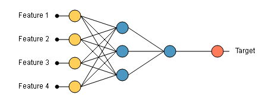
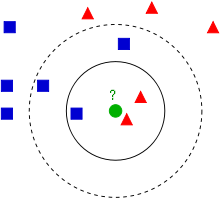
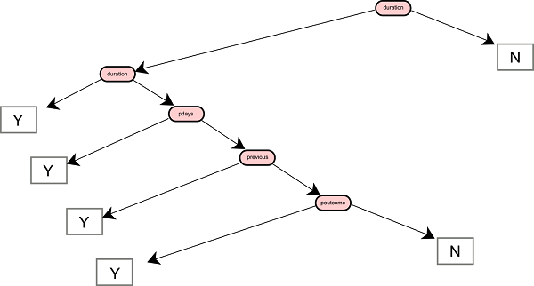
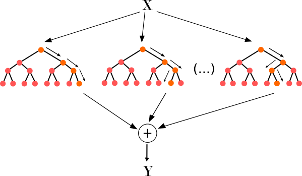

#  Data Classsification and Analysis

## Data Analysis

### Definitions # 
Nowadays, the size of the data that is being generated and created in different organizations is increasing drastically.  Due to this large amount of data, several areas in artificial intelligence and data science have been raised.  We have shown in the previous sections the different techniques that help to extract and handle the data. Hence, after having collected the data from different sources and stored them in various databases, we can proceed to many analysis steps for the aim of extracting hidden information and discriminant patterns. 
In fact, most organizations do actually a set of techniques to discover intricate relationships, discover complex patterns, and predict trends in the data. These data are modelled and then pertinent variables are identified in order to obtain useful insight on the problem and obtain intelligent decision. Figure 1 illustrates an example of what we call the advanced analytics and its components. Indeed it contains descriptive, diagnostic, predictive, and prescriptive analytics. Altogether, theses methods allow us to know what is hidden in our data, what has happened, why it happened, what will happen and what we can do to change what will happen in a way that benefits us [1].

Figure 1: The different steps in the advanced analytics.

During the descriptive analysis stage, which is the first step of our analysis, a global summary on the data yields to create a historical view on the data and prepare them for future analysis. This analysis uses illustrative figures such as histograms, pie chart, or tables, and the user can easily interpret the hidden information.

The diagnostic analytics is the next step of the analysis. It uses methods such as correlations factors for the interpretation of factors that contributed to the outcome. Here, it is important to verify the possible correlation dependencies that may exist between the input variables. It can be calculated with different way, and the less distant to 1 is the result, the more correlated the variables are. 

The predictive analytics is used for making the prediction of future values and identifying unknown events. It is the most important stage of the advanced analytics, since it involve very sophisticated methods of machine learning and data mining. 

Finally, Prescriptive data analytics is the last step of an advanced data analysis. It consists of the application of the predictive model to determine the best solution or outcome among various choices, given the known parameters. In this phase, not only is predicted what will happen in the future using our predictive model, but also is shown to the decision maker the implications of each option. 

All these advanced data analytics approaches are based on different data science algorithms that can be classified in the following categories: classification, clustering, regression, and forecasting algorithms. We notice that there are several programming languages, which implement these methods as packages or libraries. However, the widely reputed languages that are actually used in data analytics are R and Python. 
R is a user friendly and script-based language, initially proposed by a statistician community. It is actually used by a lot of data scientists, and does contain several thousands of packages. Among theme, there are, e1071, cluster, nnet,neural, funclustering, … etc. Python also supports very interesting data analytics libraries, such as, Nympy, Scipy, Sckit-learn, … etc. 

### Classification #

Classification is a category of what is called supervised machine learning methods in which the data is split on two parts: the training set and the validation set. Using the training set, a model is learned by extracting the most discriminative features, which are already associated to know outputs. This model is then validated on the test set, in which we evaluate the efficiency of the learned model by generating the adequate outputs for a given input values. One of most knows classification method is artificial neural networks [2,3]. 

### Neural Networks 

Artificial Neural Networks (ANN) are computational models based on the neural structure of the brain. They are recognized as one of the best machine learning methods.  The outputs from the neural network depend on the inputs fed to it and the different parameters within the neural network. The nnet package on R and sckit-learn on Python have an implementation of ANNs [2].

Figure 2: A simple architecture of a neural network.

### Clustering

Clustering belongs to unsupervised data analysis algorithms, in which the hidden structure of the data is learned and highlighted without any prior information. Several clustering algorithms have been proposed in the literature, such as: K-means, K-nearest neighbors, hierarchical clustering, … etc.

K-means neighbors is a simple method used for data clustering. It statrs by selecting k randomly choosed centers among the data and then tries to regroup the most similar points around each center. The position of the centers still moving untill the learned model has 
It stores all available cases and classifies new cases based on a similarity measure [7]. 

Figure 3: Distribution of several points in a multi-dimensional space. The points that have similar attributes are grouped in the same cluster.

### Forecasting

###	Decision trees

A decision tree is a mathematical model helping you to choose between several courses of action. It uses estimates probabilities to calculate likely outcomes. At each node a test is realised on each attribute, within a binary comparison. A tree is generated using a training set where the classes of the training variables are in the leafs. Having a new value, a list of tests are performed by traversing a path of the tree untill a leaf is reached. The class of the variable is the label of the reached leaf [2].

Figure 4 Example of a decision tree.

###	Random forest

Random forests are a combination of tree predictors for classification, regression and other tasks. Each tree depends on the values of a random vector sampled independently and with the same distribution for all trees in the forest.  It is one of the most popular methods or frameworks used by data scientists [2]. 

Figure 5 Example of random forests.

###	Knowledge Discovery

Knowledge Discovery (KDD) is an interdisciplinary area focusing upon methodologies for extracting useful knowledge from data. The ongoing rapid growth of online data due to the Internet and the widespread use of databases have created an immense need for KDD methodologies. The challenge of extracting knowledge from data draws upon research in statistics, databases, pattern recognition, machine learning, data visualization, optimization, and high-performance computing, to deliver advanced business intelligence and web discovery solutions.

Figure 7: [The KDD process: from data to knowledge](http://www2.cs.uregina.ca/~dbd/cs831/notes/kdd/1_kdd.html)

### Data Analysis tools and APIs

Actually there is a great number of data mining framework and APIS. A summary of the most important ones is given in the following list:

* [Weka](http://www.cs.waikato.ac.nz/ml/weka): It is a collection of machine learning algorithms for data mining tasks. The algorithms can either be applied directly to a dataset or called from your own Java code. Weka contains tools for data pre-processing, classification, regression, clustering, association rules, and visualization. It is also well-suited for developing new machine learning schemes. 
* [RapidMiner](https://rapidminer.com): It is a software platform developed by the company of the same name that provides an integrated environment for machine learning, data mining, text processing and data analytics.
* [R analytcs suite](http://rstudio.com): It is a powerful and productive user interface for R. It's free and open source, and works great on Windows, Mac, and Linux. Actually R is the top ranked data analytics language.
* [Python scikit learn](http://scikit-learn.org): It is an open source Python library that implements a range of machine learning, preprocessing, cross-validation and visualization algorithms 

### Datasets for Data Mining and Data Science

*	[AWS (Amazon Web Services) Public Data Sets](https://aws.amazon.com/fr/public-datasets/), provides a centralized repository of public data sets that can be seamlessly integrated into AWS cloud-based applications. The DBs are various and heterogenious (textual, images, financial, medical ... ). The majority of data can be managed in the Amazon cloud.
*	[Canada Open Data](http://open.canada.ca/data/en/dataset), pilot project with many government and geospatial datasets. 
*	[Causality Workbench data repository](Causality Workbench data repository.): The purpose of this project is to provide an environment to test machine learning and causal discovery algorithms on different databases that are stored in the repository. 
*	[AssetMacro](https://www.assetmacro.com), it contains historical data of Macroeconomic Indicators and Market Data. 
*	[CrowdFlower Data for Everyone library](https://www.crowdflower.com/use-cases/). It is contains training data, machine learning, and human-in-the-loop in a single, essential platform for data science teams. It is a subscribing service for data analytics tools, eg.: sentiment analysis, content moderation, text processing and cleaning, data collection, 
	Data Source Handbook, A Guide to Public Data, by Pete Warden, O'Reilly (Jan 2011). 
*	[Data Catalogs](http://www.Datacatalogs.org), open government data from US, EU, Canada, CKAN, and more. 
*	[Data.gov.uk](https://data.gov.uk/), publicly available data from UK (also London datastore.) 
*	[Data.gov/Education](https://catalog.data.gov/dataset?groups=education2168#topic=education_navigation), central guide for education data resources including high-value data sets, data visualization tools, resources for the classroom, applications created from open data and more. 
*	[DataMarket](http://www.qlik.com/fr-fr/products/qlik-data-market), visualize the world's economy, societies, nature, and industries, with 100 million time series from UN, World Bank, Eurostat and other important data providers. The data are not free.
*	[Data Planet](http://www.data-planet.com), The largest repository of standardized and structured statistical data, with over 25 billion data points, 4.3 billion datasets, 400+ source databases. It has a specific [API](http://www.data-planet.com/data-planet-api) for data searching and accessing.
*	[DataSF](https://data.sfgov.org/), a clearinghouse of datasets available from the City & County of San Francisco, CA. 
*	[DataFerrett](https://dataferrett.census.gov/data.html), a data mining tool that accesses and manipulates TheDataWeb, a collection of many on-line US Government datasets. 
*	[EconData](http://www.econdata.com/), thousands of economic time series, produced by a number of US Government agencies. However the data are available on a format which name is dx that can be read win the firm's tool.
*	[Enron Email Dataset](https://www.kaggle.com/wcukierski/enron-email-dataset), email data from about 150 users, mostly senior management of Enron. 
*	[Europeana Data](http://labs.europeana.eu/data), contains open metadata on 20 million texts, images, videos and sounds gathered by Europeana - the trusted and comprehensive resource for European cultural heritage content. 
*	[FEDSTATS](https://fedstats.sites.usa.gov/data-releases/), a comprehensive source of US statistics and more 
*	[FIMI](http://fimi.ua.ac.be/data) repository for frequent itemset mining, implementations and datasets. 
*	[GDELT](http://www.gdeltproject.org/data.html): The Global Data on Events, Location and Tone, described by Guardian as "a big data history of life, the universe and everything." 
*	[GEO (GEO Gene Expression Omnibus)](https://www.ncbi.nlm.nih.gov/sites/GDSbrowser/), a gene expression/molecular abundance repository supporting MIAME compliant data submissions, and a curated, online resource for gene expression data browsing, query and retrieval. 
*	[GeoDa Center](http://spatial.uchicago.edu/software), geographical and spatial data. 
*	[Google ngrams datasets](http://storage.googleapis.com/books/ngrams/books/datasetsv2.html), text from millions of books scanned by Google. 
*	[KONECT](http://konect.uni-koblenz.de/), the Koblenz Network Collection, with large network datasets of all types in order to perform research in the area of network mining. 
*	[NASDAQ Data Store](https://data.nasdaq.com), provides access to market data. It needs an account creation in the web site.
*	[NGS](https://www.archive-it.org/collections/317) National Government Statistical Web Sites, data, reports, statistical yearbooks, press releases, and more from about 70 web sites, including countries from Africa, Europe, Asia, and Latin America. 
*	[NSSDC](http://http://nssdc.gsfc.nasa.gov/) National Space Science Data Center, NASA data sets from planetary exploration, space and solar physics, life sciences, astrophysics, and more. 
*	[NetworkRepository](http://networkrepository.com/): Interactive Data Repository, has many collections of graph and networks from social science, machine learning, scientific computing, and other areas. 
*	[Socrata](https://socrata.com/solutions/publica-open-data-cloud/), opendata access to over 10,000 datasets including business, education, government, and fun. 
*	[Open Source Sports](http://www.opensourcesports.com/), many sports databases, including Baseball, Football, Basketball, and Hockey. 
*	[SMD](http://smd.princeton.edu): Stanford Microarray Database, stores raw and normalized data from microarray experiments. 
*	[StatLib](http://lib.stat.cmu.edu/datasets/), CMU Datasets Archive of different disciplines. 
*	[UCI KDD](https://kdd.ics.uci.edu/) Database Repository for large datasets used in machine learning and knowledge discovery research. 
*	[UCR Time Series Data](http://www.cs.ucr.edu/~eamonn/time_series_data/) Archive, offering datasets, papers, links, and code. 
*	[UK Open Postcode Geo](https://www.getthedata.com/open-postcode-geo), UK/British postcodes with easting, northing, latitude, and longitude. 
*	[Wikiposit](http://wikiposit.org/p?old_futures), a (virtual) amalgamation of (mostly financial) data from many different sites, allowing users to merge data from different sources 

### Data APIs, Hubs, Marketplaces, Platforms, and Search Engines

*	[CKAN](https://ckan.org/), the world leading open-source data portal platform, aimed at data publishers (national and regional governments, companies and organizations) wanting to make their data open and available. 
*	[DataProvider](https://www.dataprovider.com/), crawls the web to create a database of information about companies. 
*	[DatastreamX](http://www.datastreamx.com/), a global marketplace for commercial data, bringing together buyers and vendors of data onto one simple-to-use platform. 
*	[dataX](http://data.crowdanalytix.com/dataset), a collection of datasets curated and crowdsourced by CrowdAnalytix community of data scientists 
*	[Enigma](http://enigma.io/publicdata/), wants to be "Google for public data" and provide easy access to government, NGO, and other public domain datasets. 
*	[Exversion](https://exversion.com/search/), search 100K+ datasets, consume them through one simple API or upload your own data to collaborate, publish, or share. 
*	[Marinexplore](http://data.planetos.com/datasets), a platform to explore, discover, and share public ocean data. 
*	[OSDC](https://www.opensciencedatacloud.org/publicdata/): Open Science Data Cloud Repository, for very large public data sets of scientific interest. 
*	[Plotly](https://plot.ly/), data and visualization platform, with tens thousands of datasets in science, academia, public policy, and business. 

### Cross-disciplinary data repositories, data collections and data search engines

*	[http://usgovxml.com](http://usgovxml.com) : it is an index to publicly available web services and XML data sources that are provided by the US government. USGovXML.com indexes data sources from all 3 branches of government as well as its boards, commissions, corporations and independent agencies.   
*	[http://databib.org](http://databib.org) : it contains research data repositories, making it the largest and most comprehensive registry of data repositories available on the web.
*	[http://datacite.org](	http://datacite.org ) : DataCite is a leading global non-profit organisation that provides persistent identifiers (DOIs) for research data. It helps the research community locate, identify, and cite research data with confidence.
*	[http://figshare.com](http://figshare.com) : it helps academic institutions store, share and manage all of their research outputs.
*	[http://linkeddata.org](http://linkeddata.org) : It is about using the Web to connect related data that wasn't previously linked, or using the Web to lower the barriers to linking data currently linked using other methods. More specifically, Wikipedia defines Linked Data as "a term used to describe a recommended best practice for exposing, sharing, and connecting pieces of data, information, and knowledge on the Semantic Web using URIs and RDF."
*	[http://reddit.com/r/datasets](http://reddit.com/r/datasets) : It is a repository of various datasets. User can also send a query to have a database.
*	[http://thedatahub.org](http://thedatahub.org ) alias http://ckan.net : it is a powerful data management platform from Open Knowledge International, based on the CKAN data management system.
*	[http://enigma.io](http://enigma.io): Enigma puts private and public data to work to solve the world's most challenging operational problems.

###	Other single datasets and repositories

*	[http://archive.ics.uci.edu/ml/](http://archive.ics.uci.edu/ml/) : it contains about 360 data sets as a service to the machine learning community.
*	[http://crawdad.org/](http://crawdad.org/) : it is the Community Resource for Archiving Wireless Data At Dartmouth, a wireless network data resource for the research community. This archive has the capacity to store wireless trace data from many contributing locations, and staff to develop better tools for collecting, anonymizing, and analyzing the data. We work with community leaders to ensure that the archive meets the needs of the research community.
*	[http://data.austintexas.gov](http://data.austintexas.gov) : it provides easy access to open data and information about Austin city government. 
* 	[http://data.cityofchicago.org](http://data.cityofchicago.org) : data of the city of Chicago.
*	[http://data.gov.uk/](http://data.gov.uk/) : it contains different data sets in the UK.
*	[http://data.medicare.gov](http://data.medicare.gov) : It contains health data from US government.
*	[http://data.seattle.gov](http://data.seattle.gov ) : It contains health data from Seattle city.
*	[http://data.sfgov.org](http://data.sfgov.org) It contains health data from San Francisco city.
*	[http://ftp.ncbi.nih.gov/](http://ftp.ncbi.nih.gov/) it contains varius biomedical data.
*	[http://gettingpastgo.socrata.com](http://gettingpastgo.socrata.com) Provide public access to government data that can spur innovation and insight
*	[http://medihal.archives-ouvertes.fr](http://medihal.archives-ouvertes.fr) : it is a french repository for archiving scientific documents.
*	[http://public.resource.org/](http://public.resource.org/) : it provides acces to difference data bases of the US government.
*	[http://rechercheisidore.fr](http://rechercheisidore.fr)  it is a french repository for archiving scientific documents in human sciences.
*	[http://www2.jpl.nasa.gov/srtm](http://www2.jpl.nasa.gov/srtm) : Nasa datasets.
*	[https://pslcdatashop.web.cmu.edu/](https://pslcdatashop.web.cmu.edu/) (interaction data in learning environments)
*	[http://www.icpsr.umich.edu/icpsrweb/CPES/](http://www.icpsr.umich.edu/icpsrweb/CPES/) - Collaborative Psychiatric Epidemiology Surveys: (A collection of three national surveys focused on each of the major ethnic groups to study psychiatric illnesses and health services use)
*	[http://www.dati.gov.it](http://www.dati.gov.it), is an italian open data repository.

# Data visualization tools

The following sections include a  a collection of the top 10 data visualization tools :

* [Tableau Software](https://www.tableau.com/fr-fr):
Tableau Software is perhaps the best known platform for data visualization across a wide array of users. Some Coursera courses dedicated to data visualization use Tableau as the underlying platform. The Seattle-based company describes its mission this way: "We help people see and understand their data."
This company, founded in 2003, offers a family of interactive data visualization products focused on business intelligence. The software is offered in desktop, server, and cloud versions. There's also a free public version used by bloggers, journalists, quantified-self hobbyists, sports fans, political junkies, and others.
Tableau was one of three companies featured in the Leaders square of the 2016 Gartner Magic Quadrant for Business Intelligence and Analytics Platforms.

* [Qlik](http://www.qlik.com/fr-fr):

Qlik was founded in Lund, Sweden in 1993. It's another of the Leaders in Gartner's 2016 Magic Quadrant for Business Intelligence and Analytics Platforms. Now based in Radnor, Penn., Qlik offers a family of products that provide data visualization to users. Its new flagship Qlik Sense offers self-service visualization and discovery. The product is designed for drag-and-drop creation of interactive data visualizations. It's available in versions for desktop, server, and cloud.

* [Oracle Visual Analyzer](https://docs.oracle.com/cloud/latest/reportingcs_use/BILUG/GUID-7DC34CA8-3F7C-45CF-8350-441D8D9898EA.htm#BILUG-GUID-7DC34CA8-3F7C-45CF-8350-441D8D9898EA):

Gartner dropped Oracle from its 2016 Magic Quadrant Business Intelligence and Analytics Platform report. One of the company's newer products, Oracle Visual Analyzer, could help the database giant make it back into the report in years to come.
Oracle Visual Analyzer, introduced in 2015, is a web-based tool provided within the Oracle Business Intelligence Cloud Service. It's available to existing customers of Oracle's Business Intelligence Cloud. The company's promotional materials promise advanced analysis and interactive visualizations. Configurable dashboards are also available.

* [SAS Visual Analytics](https://www.sas.com/fr_fr/software/business-intelligence/visual-analytics.html):

SAS is one of the traditional vendors in the advanced analytics space, with a long history of offering analytical insights to businesses. SAS Visual Analytics is among its many offerings.
The company offers a series of sample reports showing how visual analytics can be applied to questions and problems in a range of industries. Examples include healthcare claims, casino performance, digital advertising, environmental reporting, and the economics of Ebola outbreaks.

* [Microsoft Power BI](https://powerbi.microsoft.com/fr-fr/):

Microsoft Power BI, the software giant's entry in the data visualization space, is the third and final company in the Leaders square of the Gartner 2016 Magic Quadrant for Business Intelligence and Analytics Platforms.

* [TIBCO Spotfire](http://spotfire.tibco.com/fr/):

TIBCO acquired data discovery specialist Spotfire in 2007. The company offers the technology as part of its lineup of data visualization and analytics tools. TIBCO updated Spotfire in March 2016 to improve core visualizations. The updates expand built-in data access and data preparation functions, and improve data collaboration and mashup capabilities. The company also redesigned its Spotfire server topology with simplified web-based admin tools.

* [ClearStory Data](http://www.clearstorydata.com/):

Founded in 2011, ClearStory Data is one of the newer players in the space. Its technology lets users discover and analyze data from corporate, web, and premium data sources. It includes relational databases, Hadoop, web, and social application interfaces, as well as ones from third-party data providers. The company offers a set of solutions for vertical industries. Its customers include Del Monte, Merck, and Coca-Cola.

* [Sisense](https://www.sisense.com/):

The web-enabled platform from Sisense offers interactive dashboards that let users join and analyze big and multiple datasets and share insights. Gartner named the company a Niche Player in its Magic Quadrant report for Business Intelligence and Analytics Platforms. The research firm said the company was one of the top two in terms of accessing large volumes of data from Hadoop and NoSQL data sources. Customers include eBay, Lockheed Martin, Motorola, Experian, and Fujitsu.

* [Dundas BI](http://www.dundas.com/dundas-bi): 

Mentioned as a vendor to watch by Gartner, but not included in the company's Magic Quadrant for Business Intelligence and Analytics Platforms, Dundas BI enables organizations to create business intelligence dashboards for the visualization of key business metrics. The platform also enables data discovery and exploration with drag-and-drop menus. According to the company's website, a variety of data sources can be connected, including relational, OLAP, flat files, big data, and web services. Customers include AAA, Bank of America, and Kaiser Permanente.

* [InetSoft](https://www.inetsoft.com/):

Inet Software is another vendor that didn't qualify for the Gartner report, but was mentioned by the research firm as a company to watch.
InetSoft offers a colorful gallery of BI Visualizations. A free version of its software provides licenses for two users. It lets organizations take the software for a test drive. Serious users will want to upgrade to the paid version. Customers include Flight Data Services, eScholar, ArcSight, and Dairy.com.

# Data analytics projects with social data

* [SoBigData](http://www.sobigdata.eu/): It is a project that is funded by the European Research Infrastructure for Big Data and Social Mining. It proposes to create the Social Mining & Big Data Ecosystem: a research infrastructure (RI) providing an integrated ecosystem for ethic-sensitive scientific discoveries and advanced applications of social data mining on the various dimensions of social life, as recorded by “big data”. SoBigData will open up new research avenues in multiple research fields, including mathematics, ICT, and human, social and economic sciences, by enabling easy comparison, re-use and integration of state-of-the-art big social data, methods, and services, into new research. It will not only strengthen the existing clusters of excellence in social data mining research, but also create a pan-European, inter-disciplinary community of social data scientists, fostered by extensive training, networking, and innovation activities.

# Important books and references on data analytics

* Book title: Pattern Recognition and Machine Learning: Christopher Bishop (2007).
* Book title: Apprentissage artificiel: Concepts et algorithmes. Antoine Cornuéjols and Laurent Miclet (Eyrolles, 2010)
* Online courses: [Coursera Machine Learning](https://www.coursera.org/learn/ml-classification/home), [Neural Networks](https://www.coursera.org/learn/neural-networks/home), [Text Mining](https://www.coursera.org/learn/text-retrieval/home).

# Important other links

* [http://stackoverflow.com/](http://stackoverflow.com/)
* [http://www.datasciencecentral.com/forum](http://www.datasciencecentral.com/forum)

# References

* [1]: Pattern Recognition and Machine Learning: Christopher Bishop (2007)
* [2]: Apprentissage artificiel: Concepts et algorithmes. Antoine Cornuéjols and Laurent Miclet (Eyrolles, 2010)
* [3]: Data Science et Language R : Henri Laude (Editions ENI, 2016)
* [4]: Amazon.com
* [5]: datasciencecentral.com
* [6]: kdnuggets.com
* [7]: Top 10 algorithms in data mining. Xindong Wu et al., in Knowl Inf Syst (2008) 14:1–37.
  
